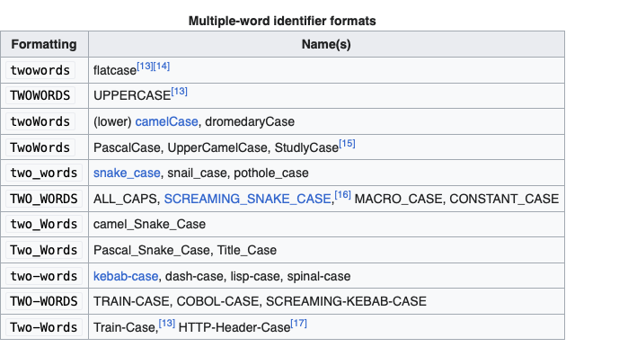
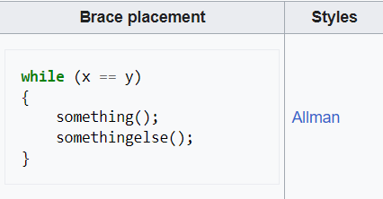

# SE & Webtech project repo

## Project URL's
Provide a link to the main page of your application. Or if you have multiple parts in your website you can provide a list of links (i.e. not all pages are in your main navigation bar)
* [Main login page](https://a22web12.studev.groept.be/public/welcome)
* [About page](https://a22web12.studev.groept.be/public/about)
* [Home page](https://a22web12.studev.groept.be/public/home)
* [Browsing page](https://a22web12.studev.groept.be/public/browsing)
* [Settings page](https://a22web12.studev.groept.be/public/settings)
* [Profile page](https://a22web12.studev.groept.be/public/profile)

---

## Website credentials
### Regular user
- login : 
- password : password
### Admin / Library manager / ...
- login : test@test.com
- password : password

---

## Implemented Features

### User Log in & Register ###
* user authentication
### User Home Page ###
### User Settings ###
### User Profile ###
### Book Page ###
* dislike/liking books
### User Browsing ###
* search libraries
* filter books by single genre
* filter books by multiple genres
* pagination

## coding conventions
### names
* upper camel case for all classes (UpperCamelCase)
* lower camel casing for all functions (lowerCamelCase)
* lower camel casing for all variables (lowerCamelCase)
* snake_case for all key naming (snake_case) used for selection
* snake_case for all csv files (snake_case)
* 
### indention
* Allman for functions and classes
* K&R for css blocks
* 
* 

