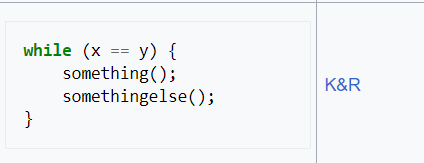

# SE & Webtech project repo

## Project URL's
Provide a link to the main page of your application. Or if you have multiple parts in your website you can provide a list of links (i.e. not all pages are in your main navigation bar)
* [Main login page](https://a22web12.studev.groept.be/public/welcome)
* [About page](https://a22web12.studev.groept.be/public/about)
* [Home page](https://a22web12.studev.groept.be/public/home)
* [Browsing page](https://a22web12.studev.groept.be/public/browsing)
* [Settings page](https://a22web12.studev.groept.be/public/settings)
* [Profile page](https://a22web12.studev.groept.be/public/profile)

---

## Website credentials
### Regular user
- login : 
- password : password
### Admin / Library manager / ...
- login : test@test.com
- password : password

---

## Implemented Features
### General ###
* About Us page
* Bookable logo to home page
* Navigation bar which updates based on user's login status

### User Log in & Register ###
* user authentication
* log in
* log out
* register
* set up username
* set up email
* set up password
* confirm password
* authentication mail (check your spam)

### User Home ###
* display the recommended books based on user's followed books, based on the author of the book
* display the trending books based on the number of likes
* display random books based on each of user's followed genre
* link to the book page

### User Settings ###
* setting profile picture
* setting profile description (bio)
* setting preferred genres
* editing password
* 
### User Profile ###
* display user's profile picture
* display user's profile description (bio)
* display user's followed books
* display user's liked books
* display user's disliked books

### Book Page ###
* dislike books
* liking books
* follow books
* unfollow books

### User Browsing ###
* search libraries with book title
* filter books by single genre
* filter books by multiple genres
* displaying the number of search and filter results
* link to the book page
* previous and next page

## coding conventions
### names
* upper camel case for all classes (UpperCamelCase)
* lower camel casing for all functions (lowerCamelCase)
* lower camel casing for all variables (lowerCamelCase)
* snake_case for all key naming (snake_case) used for selection
* snake_case for all csv files (snake_case)
* snake_case for all html ids and classes (snake_case)
* 
### indention
* Allman for functions and classes
* K&R for css blocks
* 
* 

